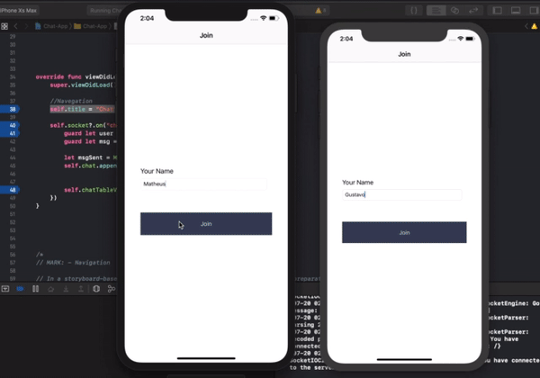

# ChatApp

**ChapApp** is a project for learning how to make Chat with Swift and NodeJS.



### Dependencies 

- [socket.io-client-swift](https://github.com/socketio/socket.io-client-swift)
- [Simple-Chat-Socket.io](https://github.com/dericeira/Simple-Chat-Socket.io)

### Installing

To run the server, we need to insert the folder that contains the `package.json` file.
1. Installing NodeJS dependencies:

```shell
$ npm install
```

2. Running the server:

```shell
$ npm start
```

## Thank for watch!
